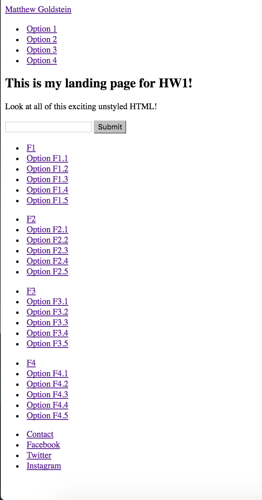
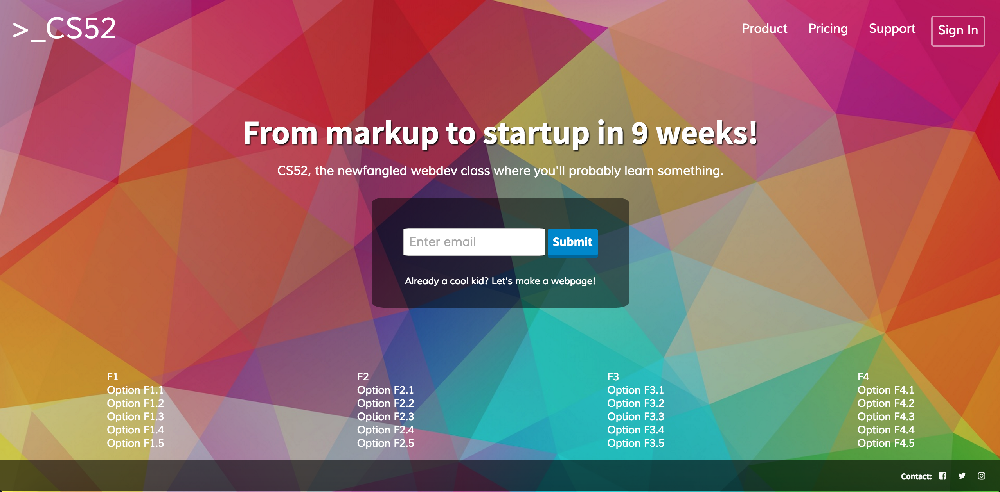

#README for HW1
##CS52, 16X -- Matthew Goldstein

###Process

I first completed the HTML file by using `
`s with `id` values, as well as ``s to ensure that I could line things up properly. I separated the page into a few main parts:

- the **navbar**, which has in it both the website title (the >\_CS52 in the upper left) and the navigation links (in the upper right)
- the **page info** section, which has the text in the middle of the page, as well as the input form and submit button
- the **bottom links**, which has the four columns of links and column headers found on the bottom of the page
- the **footer**, which has the contact/social media links

When I completed the HTML, my site looked like this:

However, then I added in CSS. I used flex boxes and classic CSS styling to make the site look pretty. After my CSS add, the site looked like this (I also switched up the text present):

I opted not to use a gradient near the bottom, because with the background I chose, it looked sort of ugly. But I did have to ensure that when my site was squeezed narrow, it would still look great. I styled the flex boxes accordingly, and got something like this:

As is evident, the menu on the top right went from horizontal to vertical, as did the input form/submit button combo below that. The bottom links also went from horizontal to a drop-down list configuration.
